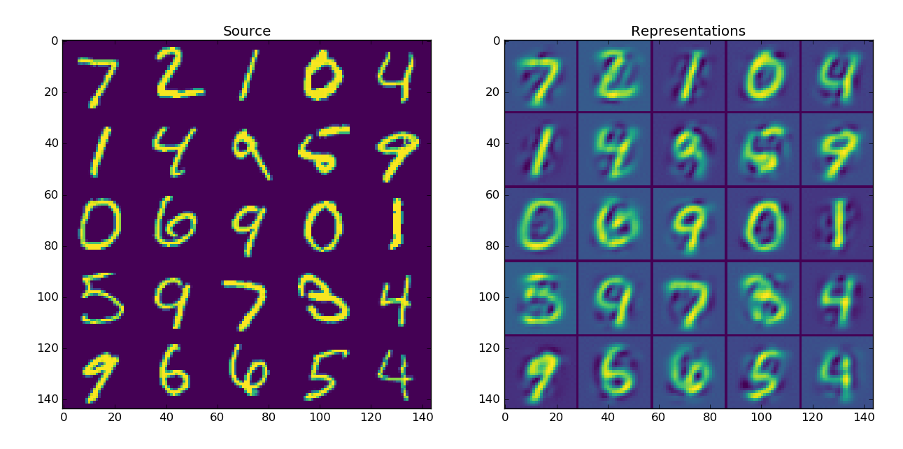
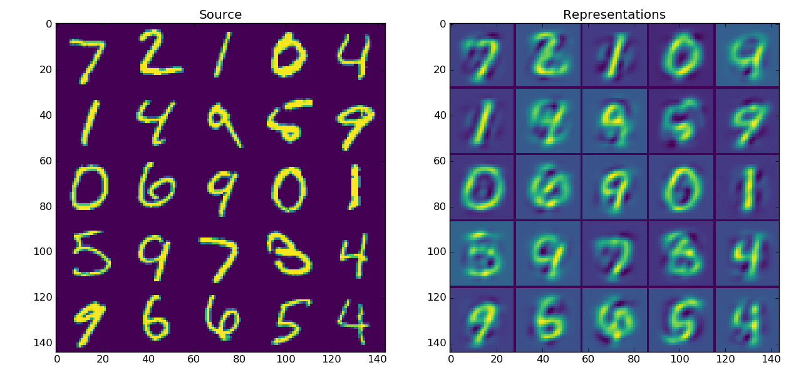
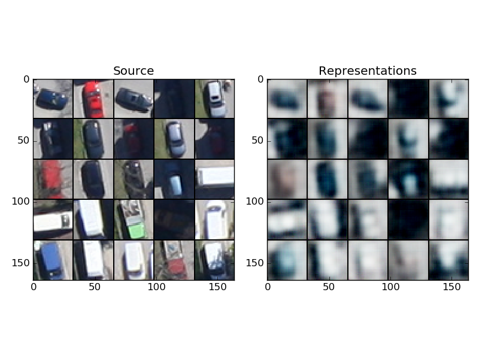

# Keras autoencoders (convolutional/fcc)
This is an implementation of weight-tieing layers that can be used to consturct convolutional autoencoder and 
simple fully connected autoencoder. It might feel be a bit hacky towards, however it does the job.

It requires Python3.x. [Why?](http://python3wos.appspot.com/)

## Convolutional autoencoder [CAE] example 

Run conv_autoencoder.py.
Conv layer (32 kern of 3x3) -> MaxPool (2x2) -> Dense (10) -> DePool (2x2) -> DeConv layer (32 kern of 3x3)

Weights of Conv and Deconv layers are tied;
MaxPool and DePool shares activated neurons. 

## FCC autoencoder example

Run fcc_autoencoder.py.
FСС (50) -> FСС (30) -> FСС (30) -> FСС (50)

## ConvAutoEncoder on 1100 cars 

Vehicle images are courtesy of German Aerospace Center (DLR)

Remote Sensing Technology Institute, Photogrammetry and Image Analysis
http://www.dlr.de/eoc/en/desktopdefault.aspx/tabid-5431/9230_read-42467/

Run 1100cars.py.

